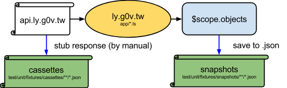
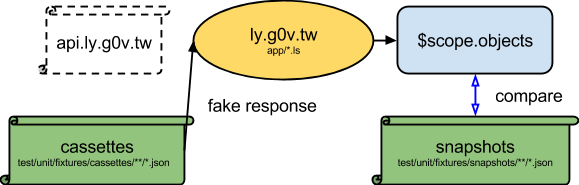

ly.g0v.tw
=========

[](https://coveralls.io/r/g0v/ly.g0v.tw?branch=master)

WARNING: this is work in progress and the file format is likely to change!

# Usage

Install required packages:

```
$ npm install
$ npm run build
```

Start server:

```
$ npm run dev
```

then open http://localhost:3333/

# API Endpoint

By default the frontend uses api.ly.g0v.tw.  The code is at http://github.com/g0v/api.ly

# Terminologies

List some terminologies which will be used in source code

* sitting - 會議(maybe 院會)
* bill - 提案
* debate - 質詢
* motions - 議案
* committee - 委員會
* annoucement - 報告事項
* discussion - 討論事項
* exmotion - 臨時提案
* interpellation - 質詢事項

# Note

While running deploy if following message is shown:

```
fatal: Not a valid object name: '-m'
```

It is a bug of git fixed after 1.7.11.4. Check you git version (`git --version`) and upgrade if < 1.7.11.4.

# Cordova - mobile

Using Cordova as a platform for building mobile apps

Install Cordova through npm

```
$ npm install -g cordova
```

after you install go to the folder `contrib/ly_ios` in this repo and enter the following command:


```
# install emulators on ios
$ npm install -g ios-sim

# add ios platform on cordova
$ cordova platform add ios

# launching !!
$ cordova emulate ios
```

and you are launching your app. Reference: https://github.com/apache/cordova-cli

## Setting in cordova :

Setting in cordova is really easy, all the settings are in `contrib/ly_ios/ly_g0v/config.xml`

```
<name>ly.g0v.tw</name>

<description>
    ly.g0v.tw - Congress Website
</description>

<author href="http://g0v.tw" >
    g0v.tw
</author>

<access origin="*"/>

<content src="http://localhost:3333" />  <!-- which url you want to direct to -->
<!-- <content src="index.html" /> -->

```

# Test

## Unit test Architecture

1.  Stub the response of api.ly.g0v.tw and save $scope.something

    

2.  Compare the snapshots and $scope.something

    

## Run tests

*   Unit test

    Choose one browser to prepare the test environment, and run the commands:

    *   Chrome

            npm run test:unit

    *   Firefox

            sed -i 's/browsers: \["Chrome"\]/browsers: \["Firefox"\]/' test/karma.conf.ls
            gulp --require LiveScript test:unit

*   E2E test

## karma

Reference: <http://karma-runner.github.io>

## protractor

To run protractor, first you need to run server for client side code described in [Usage](#usage).

Then

```
$ npm run protractor
```

Reference: <https://github.com/angular/protractor>

# License

The MIT license: http://g0v.mit-license.org/
