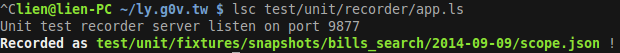

# Snapshots recorder server

Save the result ($scope.xxx) sending from unit test.

In unit test:

    it 'xxx' do
 
      # create-controller and $http-backend.flush!
      ...

      # $scope.xxx should be assigned.
      # Send the $scope.xxx to recorder server
      $.ajax do
        type: 'POST'
        url: 'http://localhost:9877/record'
        data:
          path: 'test/unit/fixtures/snapshots/xxx/scope.json'
          json: JSON.stringify {$scope.foo, $scope.bar}
        data-type: 'text'

Open recorder server:

    lsc test/unit/recorder/app.ls

Run the test:

    gulp --require LiveScript test:unit

Then you will see:

